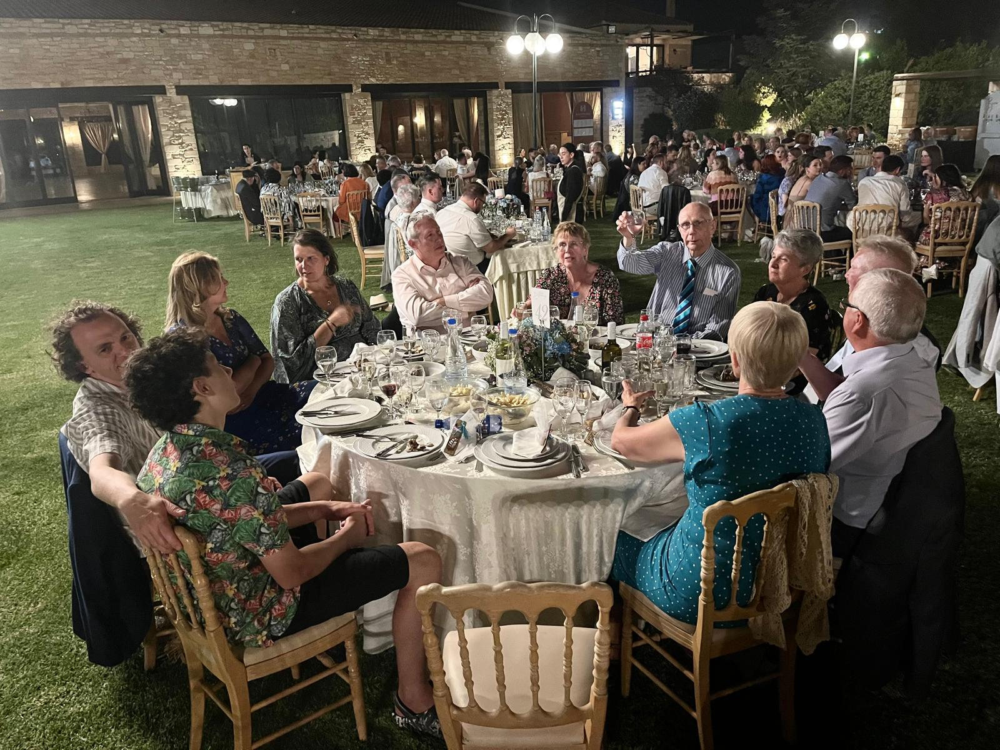
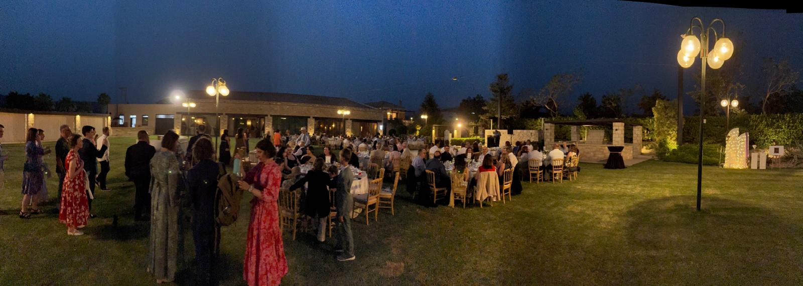

> "A Reilly male is never without a handkerchief" - Kirsty Kissell née Reilly 

It was a warm day in Crete. By warm, I mean 38 degrees Celcius. Classic British understatement really; it was, in point of fact, unconscionably hot.

The wider Reilly family had been landing in Crete in preparation for Dominic's wedding to Eleni. Dominic is my cousin, the eldest child of Frances and Jim. Frances is the youngest sister of my mother Ann. To Fran's great delight, Frances is closer in age to me, than to her oldest sister / my mother. For Catholic reasons.

Dom, who's birth I discovered from a note pinned to my bedroom door at university, was due to marry a girl named Eleni who was a Cretan. For clarity, let me say that this is not some sly dig, rather, if you are from Crete, it turns out you are a "Cretan". As a lady named Cassandra explained "yes, we know what it sounds like, but that is what we are". I appreciated that they refused to be bowed by any attempt at mockery at their chosen name and effectively said "no, this is ours".

On Saturday 24th May 2025, a variety of Reillys, Kissells, Kerrs and more had assembled on the Greek island of Crete. All set for the wedding that would unite Greek and UK families.

Whenever you have the privilege to attend a wedding of a culture that is not directly your own, it is fascinating. The differences and the similarities clamour for your attention.

As someone born and bred in the UK, the first difference I noticed was the start time. The wedding was set to officially start at 7pm. Back home, 1pm would be more typical. But as we sweated our way through 38 degrees that day, the logic of the start time became undeniable. If it started at 1pm, we'd be passing out in our suits by 1:15.

The entire wedding took place outdoors. Coming from a country where it rains half of the time, and a further quarter of the time it looks like the weather is considering a dowsing, it seemed inconceivable to have an entirely outdoor wedding. And yet that's what it was. The service took place in a large courtyard with a chapel in the centre. The reception took place in a garden under the open sky.

The nature of the service was different as well. In the UK, you show up at a church. You sit in a seat and stand and sit as you are directed. You sing some songs. You observe the vows. Typically there will be some kind of address and some prayers. But what is a given, is that all eyes are on the ceremony.

In Crete, it's a little different. There's a few chairs laid out, but these aren't for everyone, more for those who really need to sit. Everyone else stands around at varying distances from the ceremony that is taking place. And there's a lot more people. So many that if you're further back, you probably don't really know what's going on. And that appeared to be fine. In fact, for some people it seemed that whilst they were happy to be here for the wedding, paying close attention to the ceremony did not appear entirely necessary. They weren't exactly second screening the wedding. It was more like "yes there's a wedding, but there's other things happening too - I haven't seen this guy in, oooh, weeks!"

The wedding service was conducted in, I assume, Greek. Whatever happened, I didn't really understand it. It was, as they say, "all Greek to me". I think it was a Greek Orthodox wedding, looking at the outfit of the priest and the paintings of icons in the chapel. Dominic is Catholic, and whilst Catholic and Greek Orthodox have differences, there's a lot more that unites them rather than divides them.

The priest was a bearded chap, with a full head of hair and an impressive gown. To my great surprise, he appeared to be the older brother from another mother of one of the curates of my own church back in Twickenham. I took the opportunity to let the Anglican priest in England know I'd encountered his probable relative near Heraklion. He pondered it may actually be him in future, suggesting he has some knowledge of time travel and flexibility in theology which hadn't hitherto come through in his sermons.

Hurling of confetti or rice is something that appears to be shared across the cultures. Towards the end of the ceremony, a large bowl of rice went around the crowd, from which everyone took a handful. Someone said the Greek equivalent of "at my signal, unleash hell" and the bridal party, who were processing around the table where the service was conducted, began to be pelted with the hard rain of uncooked rice. What started as entertainment to me, mutated into genuine concern. The rice being used was risotto style and the grains were quite circular. I feared if we were using basmati we could have had someone's eye out. The priest had wisely decided that the magnificent Bible being used in the ceremony, could do double duty as a makeshift umbrella. Not his first rodeo.

[The couple and the priest rounding the table whilst being pelted with rice](hard-rice-rain2.jpg)

With the ceremony complete, the wedding moved into a large garden and the eating and drinking began. Greeks like to eat. I thought I liked to eat, but I now realise I don't even feature on the leaderboard. It was explained to us that a flock of sheep, belonging to Eleni's family, had been executed and roasted for us that day. We had seen racks of meat roasting in the corner when we first arrived.

[Lamb roasting on an open fire](lamb-being-roasted-on-an-open-fire.jpg)

So we ate, sat in the open air. It was dark by now, and we couldn't always tell what we were eating. But it was great. We ate more. Then more. Curiously, we hadn't eaten any lamb. Unless it was disguised perhaps? But whatever we had eaten, it had been fantastic, and very satisfying. As we sat back and focused on digestion, Jim (Dominic's father) approached. 

"Now I just wanted to give you a heads up. We've had the aperitif, and we've had the starters. Next we've the mains, which is Gamopilafo. And after that there's the mutton course, of course." We blinked slowly at this news. Jim grinned, nodded and headed off to share the information with other tables. I made a strategic decision to go down a belt buckle at this point in preparation. 

Gamopilafo is also known as "Cretan Wedding Rice".  It's lamb which has been roasted, and rice and pasta which has been cooked in the stock of the lamb, with lemons. It's kind of a brothy risotto and it is fantastic. As it arrived we reached down to our reserves of eating space, and tucked in. Gosh it was good. 

We ate what we could, then sat back. Overwhelmed. I was mulling how many belt buckles a man could go down. Much food was subsequently removed from the table. As Jim had predicted, then came the mutton course. I think it was called Antikristo.

We tried a forkful. It was exceptional. Such a shame then that there was no way we could have much more. In the end, we sat there staring at the meat, occasionally stirring and chopping and consuming a mouthful. Each time it was a reminder that a mouthful was too much. We couldn't eat more. We felt meat guilt as they belatedly took away plates which must have contained nearly the same amount of meat as they arrived with. 

We heard, some days later, that the uneaten food was not wasted, and will have been eaten over the next week or so by the family. I'm writing this a week later, so I'd say by now that Eleni's family have reached peak lamb, passed through it, and are now making resolutions to never eat lamb again. Well, until the next wedding at least.

Main courses out of the way, the wedding turned to dancing. There was a traditional Cretan dancing display lead by a troupe of dancers in costume . It seemed to involve a lot of high kicks and jumps from the most athletic member of the troupe and more sort of "bobbing up and down" style dancing from the other five members. No doubt I'm doing them a disservice with that description.

Towards the end of their display, everyone was invited onto the dancefloor to do some traditional dances. I think "Zorba the Greek" may have featured as part of this. Bruce, Kirsty and a variety of other family members headed to the dancefloor to get involved in the action. There was swaying and linking of arms, and also a conga. I would have joined in, but recent back issues meant I had to appreciate from the sidelines instead.

The male members of the family were all gifted traditional Cretan wedding scarves called Sarikis. If you can imagine the scarf worn by scouts, but rendered as a decorative string vest with tassels, that's roughly what they were. If you look at this picture of my father, you can see what I mean.

[Dad dressed in a sariki](dad-in-his-sariki.jpg)

The traditional music gradually shifted to more modern music. Well, Abba. It was at this point we became aware that my youngest brother Peter had somehow acquired a microphone.

Speeches, a standard feature of English weddings, appear not to be a feature of Cretan weddings. My mother was slightly forlorn at learning this, counting the speeches as potentially one of the best bits of a wedding. If the speech was good that is.

Peter had evidently decided that his role in the wedding was to bring a UK tradition to bear. A noble aspiration. "Dominic is a beautiful man, beautiful inside and out..." he intoned. So far so good, though he seemed to be going toe to toe with Donald Trump in his love of the word "beautiful". He continued "and Eleni is alright too I guess..." 

"Oh Peter! You can't insult the bride" wailed Mum. The speech continued onwards and featured references to "Wise One", Peter's chosen term of endearment for Dominic's mother Frances. The speech meandered for a while; the uncharitable in the audience may have considered that perhaps it hadn't been entirely prewritten.

Peter, realising perhaps that he was in need of a punchy ending to the speech, opted to sign off in an unexpected fashion. He offered an appreciation of the dancing that we had seen thus far, and that he'd like to perform his own dance for the bride and groom. I'd like to report that I took the moment to look in their direction and gauge a response. But to honest, it was hard to look away from Peter at this point. Slow motion car crashes are undeniably compelling.

The DJ put on some kind of dance track and Peter, taking the whole dancefloor to himself, proceeded to vibrate with energy as he danced. If the guests weren't surprised enough by what was taking place, his regularly dropping in the breakdance move "the worm", which involved hurling his whole body forwards onto the ground, wriggling and propelling himself back upright, certainly impressed them. By the end of the song the audience applauded wildly.

At the last Greek wedding I'd attended, I discovered a university friend had a significant alcohol problem.
It seemed almost appropriate at this wedding to discover that my brother Peter was making every effort to appear he may be ploughing a similar furrow. On the upside, Peter seemed to be enjoying it all a lot more than my university friend. Upon reflection, I may well be drawing an ungenerous parallel.

Peter had clearly had the time of his life. Never one to be bothered by the showbiz saying "always leave them wanting more", he did further dance displays over the course of the evening. Frances later reported that Dtavros and Yianna "loved your energy!!"

One final tradition which seems to be shared between the UK and Greece, is the throwing of the bouquet. Eleni threw her bouquet into the crowd. And, as luck would have it, the best man, Dominic's brother Patrick, caught it. He was delighted.  His boyfriend Luke, was perhaps best described as "startled" as Patrick cackled like a mad thing.

Elsewhere, the younger children were now exhausted. Accustomed to being in bed by 9pm, they now found themselves dressed in suits, stuffed with food and drink, and still awake at 1 in the morning. The wedding was due to run until at least 3am. Our youngest boy James occasionally lay on the ground and gave a thousand yard stare. At this, parental guilt broke in. Realising this was a once in a lifetime occurrence, neither Lisette or I wanted to leave. But we realised that as responsible parents, we probably should. So, with reluctance, we summoned our taxi. 

My parents and Peter and his son Joseph decided to join us. Eight of us sped along the darkened Cretan roads headed back to our hotel. It had been an incredible night. 

