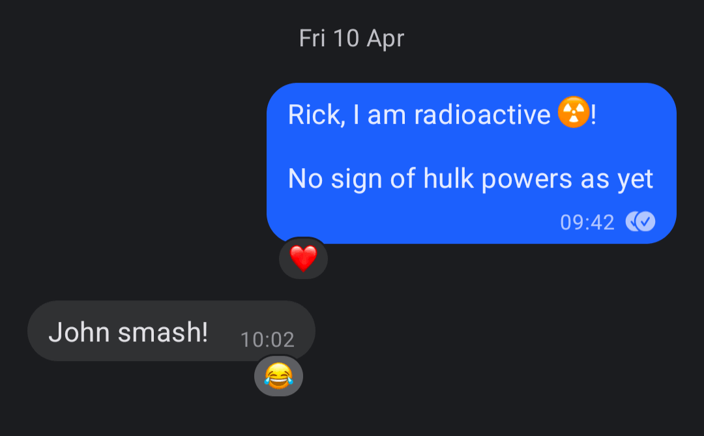
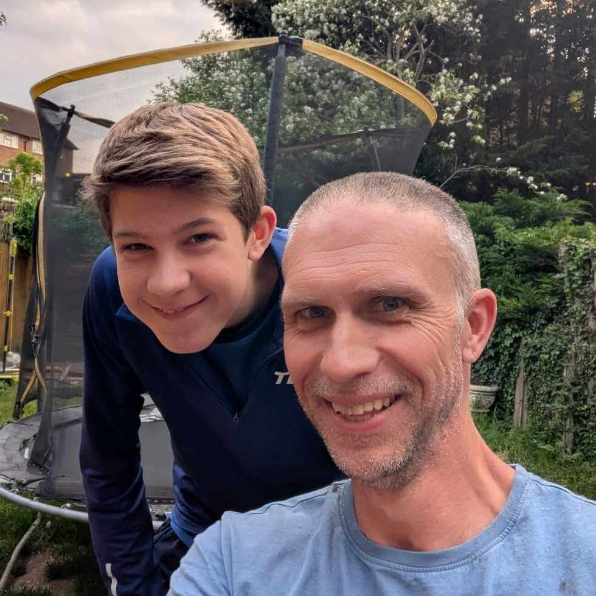

If you read [my last post](../2025-12-28-reflections-on-a-difficult-year/index.md), you'll know that 2025 was a hard year for me. I had back issues which made the year a challenge. At the start of the 2026, my feeling was that whilst 2025 had been hard, 2026 should be easier. Somewhere in the universe, 2026 said to 2025 "Hold my beer".

I'll cut to the chase; I've had a cancer diagnosis.  Which is pretty tough.  I'm writing this to share the story of where I am, where I'm going, and maybe to encourage others.  Not that I think I'm a poster boy for encouragement right now.  But perhaps I'll get people thinking about doing medical tests sooner rather than later.  That alone would be worthwhile. 

## Something is not right

At the start of March 2026, I felt like I was in the best shape of my life. The back issues were mostly abated.  I still had some symptoms, but they weren't bad.  The truth is, that suffering back issues had lit a fire underneath me in terms of exercise, my diet was intentionally more healthy than it had ever been.  I felt good.  Really good.

Then I started to notice blood in my poo.  There's no way to write that gracefully.  It's slightly gross. I had been eating beetroot, that reddifier of vegetables and so I wasn't initially worried. However, the redness didn't go away, even after the beetroot did.  And the poo was showed appearance of mucus, which was not normal. So I went to the doctors.

The doctor got me to do a stool sample and a blood test.  The results of these were reduced iron in the blood and too much blood in the poo. There's a number they look for that they want to be under 10.  Mine was over 200. 

On March 24th I was sent for a colonoscopy and gastroscopy (a word I still cannot pronounce).  The blunt description of what these procedures are, is putting a small camera up your behind and down your throat respectively.  Though thankfully not in that order, and (although in my sedated state I was in no position to check) I imagine they may even treat themselves to different cameras depending upon the orifice.  This is about as fun as it sounds, and was prefaced by me taking some industrial strength laxitives. This is also as fun as it sounds.

When a doctor comes to see you after a test or a procedure, you ideally want them to look a bit busy and bored. You want the sense that you aren't uppermost on their mind.  Ideally they should look distracted, as though they're thinking about the next important patient. When the doctor came to see me, and Lisette who was sat by my side, they asked us to come with them. They lead us to a separate room.  They sat us on a sofa. This achieves not a great deal more than to get you thinking "ohhh noooo....."

That was an appropriate reaction.  It turned out I had a tumour in my sigmoid colon, about 40 cm inside of me.  They didn't know if it was cancerous as yet, but it didn't look good and they'd taken samples to get tested. I remember the doctor saying words like "treatable" and phrases like "potentially good outcomes", but it's all a bit of a blur.  

They decided to do a CT scan to have a look at the rest of me. A CT scan seems to be where they whip you through some machine and back again and (I think) sort of photocopy your insides for general intrigue. My photocopy was a disappointment.  Not only did it show up the tumour, it showed something in the liver and something in the lungs.  I needed more tests.

I left the hospital in a daze. Cancerous or not, I knew there was at least an operation in my future, and I was stunned. Going into the hospital I was braced for, at worst, a "you have piles" diagnosis.  Not this. Not ever this.

Time passed.  And very slowly.  That first night after the diagnosis Lisette and I held each other as we lay in bed, and wept. 

In the end, I slept. You forget what's happening in your life when you're dreaming. When times are bad that's a blessed relief.  So it was on this night, and many following.  I would rest, sleep and forget what was happening.  Then I would come to at maybe three in the morning and think "I've got cancer.... ****".  I've removed the expletive from end of that sentence, as I'm not proud of it.  I said that same sentence maybe a thousand times over the next month. It was reliably followed by a suffix of "sorry God". For what it's worth, I think God is probably fine with an honest reaction to circumstances like this. I can't explain how my brain works and I'm oversharing I know. I think I want you to understand where my head was at.  It was all over the place.  And fair enough. 

## How bad are things?

Several years passed.  I mean days, but they felt like years. The call came confirming the tumour was cancerous. I was assigned to a friendly consultant. He told that me I was exceptionally young for such a diagnosis, but that it was happening more and more with younger people. I've often been an early adopter in life. I was less pleased about this particular one.

Tests were scheduled to see what was up with the rest of me; an MRI (I think for the liver) and a pet CT scan.  A pet CT scan is like a CT scan but with much higher fidelity and also radioactivity. Before my scan began, they explained they were going to inject me with a radioactive isotope, and that for a period of time I should try to avoid pregnant people and young children.

As stunned as I was that I was now a walking Geiger counter risk, it did give me the chance to joke to friends that I was keeping my eyes peeled for the development of superpowers. 

Travelling home on the District Line tube afterwards felt very strange as I tried to avoid all other humans.  I also felt guilt that I'd forgotten my nuclear state partway to Earls Court station and bought a coffee, no doubt sharing my radioactivity with folk who'd only really signed up for caffeine.

I got the results the following week. I was walking down the road on the morning of April 15th when the phone rang.  It wasn't a number I recognised but I picked up.  It was the consultant. First the good news; my liver had come back as having 2 cysts.  This didn't worry him.  Now the bad news.  As well as a tumour in my colon, I also had one in my lung. Smaller than the colon, and presumed to be a "secondary" that had spread from the colon which was believed to be the "primary".

I found myself squatting on the side of the road, watching cars go past and trying to work out if I was dreaming.  It didn't seem real.  It didn't seam plausible. My parents are healthy folk, happily retired and very active.  

Admittedly my dad's parents had died of cancer.  But my dad's dad smoked between 100 and 200 cigarettes a day. He was one of 11 children. Not an unusual number of children in Catholic families back then.  My Great Uncle Joe was the only one of the 11 who didn't smoke, and didn't die young.  As they were growing up, G.U. Joe shared a room with my grandad and many of the other siblings.  G.U. Joe said he used to wake in the middle of the night and see "the cherry on your grandfather's cigarette slowly working it's way down through the darkness towards his mouth".  Safe to say, my grandad lived a life which pretty much invited the lung cancer that eventually claimed him at 56. As I told various medical professionals about my grandad's prodigious habits, they also dismissed him as a concern. I think I'm the first colon cancer in the family. Again, I'm hating being an early adopter.

We arranged to see the consultant on the Saturday. Prior to this, the plan had been to operate on my colon and maybe follow up with chemotherapy.  Now, with two tumours in the mix, the consultant was going to transfer me to the Royal Marsden and expected we would start with chemotherapy and try and attack both cancers at once.  I likely had surgeries in my future as well, but chemotherapy first. And probably after as well.

This was a further blow. I'd mentally pencilled in the cancer as maybe being a focus of the next three months.  Now it sounded like 2026 would likely be treatment focussed in some way.  I asked the consultant: "what are my odds"?

The consultant responded "if we did nothing, you'd probably be dead in a year". This left me reeling.  I felt so good.  How could I be dying?  I'm dying? What? How can I be dying? I can't die now.  I'm a dad.  I'm a husband.  I need to keep being those things.  I can't die now.  I can't.

## How did this happen to me?

That's the question I sat with now.

My lifestyle is pretty healthy.  I drink, but not much.  I'm not a smoker. I exercise a lot (all the more since the back issues); walking, physio, pilates, clinical physical training and gym.  We eat organic and have done for years. We have avoided ultra processed foods essentially since we started learning what they were. We bought nitrate free meat. 

Frankly I was and am pretty much a poster boy for how you're supposed to be living. Maybe I hadn't done enough. I'm a software developer, so I started to debug my lifestyle.  What could have caused this?

- torn teflon on a stock pot?
- too much red meat / pork (I have always liked pork)
- too much processed meat?  (Nitrate free or not, I've long been a consumer of large amounts of chorizo)
- burned meat on the braai / barbeque?
- alcohol?

The reality is, it could be none of the above.  And that I'm never likely to know what started this. Quite likely it started independent of my own actions and choices.  Which doesn't make me any happier.  In fact I learned quite quickly of a friend who had been diagnosed with a similar cancer to my own a couple of years ago.  In their case, they are Jewish and so were definitely not consuming pork / chorizo.

Regardless of whether any of the above contributed to the cancer, my brain had kicked in. I needed to feel that I was making changes that could prevent cancer from reoccurring when I recovered. So whether they are a factor or not, the torn teflon stock pot has been hurled from the front door. Screw that guy. I bought a fancy, non teflon alternative for an eye watering amount of money. I am unlikely to eat chorizo again much in this life.  It may have nothing to do with the cancer at all, but it'll taste like ashes in my mouth from now on. I'll still eat red meat, but much less.  I'll still drink in future, but I'm not drinking right now. I could go on. I shan't.

## God, what's going on?

I'm aware not everyone reading this will have a faith.  Or your own could be quite different to mine. I'm not asking you to agree with me, or to correct my theology (which is no doubt imperfect) but I want you to understand what went on inside of me. What's going on inside of me.  For my knowledge is not finished.

Initially I wailed and raged at God.  I begged for this not to be happening.  I cried.  I prayed for healing.  But my poo stayed red. I was desparate.  I was sad.  I was so very sad. And scared. Let me not miss that out. I'm crying as I'm writing this now. I'm not saying that to spark sympathy.  Rather, I want you to understand that I'm still "processing".

I became a Christian when I was about 5 years old.  It was at a half term club run in a Baptist church round the corner from my home. My immediate and wider family are Christian (with a high percentage of Catholics and even one nun in the mix - [I do their website badly](https://www.poorclaresarundel.org/)).  My faith has been a constant throughout my life.  I experimented with living without God for a bit in my early twenties thinking I would be increasing my fun. It turned out to merely increase my loneliness and so I thought better of it.

In the end, I find it hard to make sense of a world, of a universe without God. For whatever reason, I just don't buy it. I may be hardwired that way.  Who can say.

I'm writing this passage as I know people can struggle with their faith at times of hardship.  This has not been my experience.  I think that deep down, I believe that God exists, God is good, and God loves me.  But I know also that this world is imperfect and unjust. Further to that, I don't honestly understand God fully.  I'm not sure I'm able to in this life.  And that's okay.  

My diagnosis coincided with Easter. That annual part of the Christian calendar where we remember Jesus, God in human form, suffering horribly and then dying for us. I felt very able to identify with the suffering this year.  Maybe I actually understood it properly for once.  I don't know. 

My church, [St Stephen's in Twickenham](https://www.st-stephens.org.uk/) has been very good to me over this time. They've met with me, they've talked with me, they've prayed for me.  They've seen me cry *a lot*.  They've held me.

I've struggled with some horrible thoughts. Did I bring this on myself? Did I earn this?  Is the only way God can use me, is if if I've been visibly suffering? As I've said, my headspace has not been good. A message that I've been reminded of a number of times has been this: if situations are rubbish, God still works to the good in them. This is a rough paraphrase of Romans 8 v28. 

Whilst I don't want to deal with the stuff I'm dealing with, I am convinced of God's ability to work through terrible circumstances. I have noticed more evidence of kindness and love in the last month than probably in any other month of my life. I'm aware of people without faith thinking about me, and people with faith praying for me.  All of this is love.  All of this is love.

## The road ahead

I've got a fair amount of treatment in my future. It starts with chemotherapy which is likely to rid me of my hair. Rather than wait for that, we made a ceremony. My boys shaved my head in preparation. The hair went on my terms.  For some reason, that is pleasing.

The doctor that first gave me the tumour diagnosis said "you have a rough road ahead of you".  The most important thing to take away from that sentence is this: I have a *road* ahead of me. I intend to travel it.

God is good. It is going to be okay. Even if we can't always see it. 

Let me sign off by quoting the English playwright Alan Bennett. Amongst his many life achievements, Alan was diagnosed with, and successfully treated for colon cancer, going on to do many many things afterwards. He wrote about the experience in his memoir Untold Stories and signed off by saying simply: *"Take heart."*

God willing, in time I shall. In fact, I can feel it beginning.
