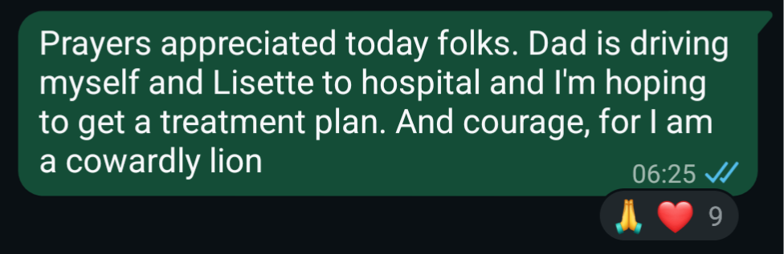
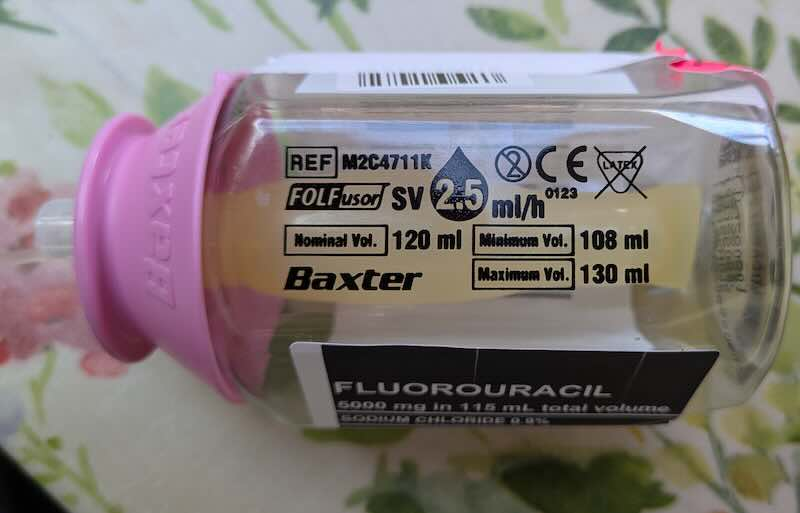
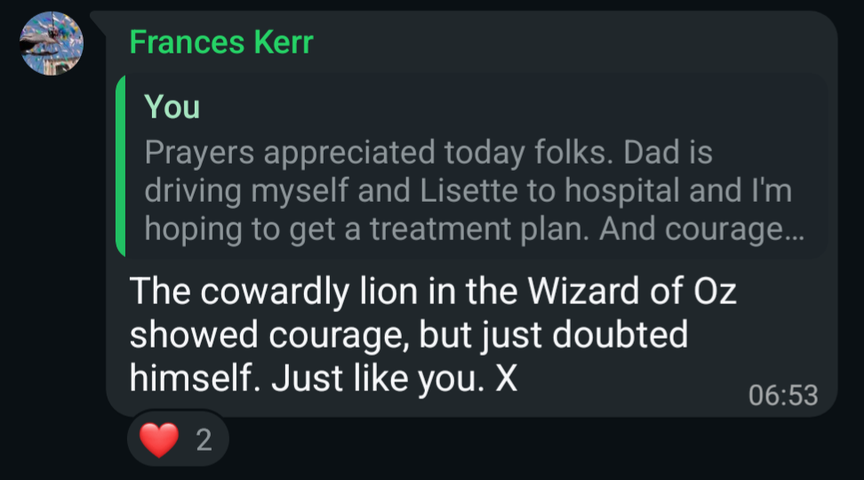

The first thing you should know about me is I'm a physical coward. The second is I'm quite squeamish. The third is I don't like needles.

Needless (little pun there) to say, cancer treatment really doesn't want to meet me halfway. Pills? No. Needles? Yes! And more besides!

If you're anything like me, you may want to cut your losses and stop reading now. Please feel free, if I was you I think I would too.

## Treatment 

[When I last wrote](../2026-04-30-rough-road-ahead/index.md), I was anticipating getting treatment for my cancer diagnosis. Getting the diagnosis had been a drip, drip of bad news. Once we'd got there though, the question then became "what can we do about all this then?"

I had, as I've mentioned previously, been very much hoping for a sudden miraculous healing. Having been in and out of churches my whole life, you become aware of the occasional modern day miracle. It's rare in my experience, but ongoing, and I would have quite happily had a piece of that action.

That didn't happen. I've heard it said that the answer to prayers can be "yes, no or... not yet". That was a helpful framing for me. For what it's worth, a lack of upfront healing didn't dent my faith in God. That's not my basis. I still believe; that's unchanged. In my head I chalked it up to "I don't always understand God". There's lots of things on my "I don't get it" list, but they don't rob me of a relationship with God. I mean, I don't always understand my wife, why should I always understand God?

It seemed that recovery from cancer was going mean going the long way round. Maybe there's a bigger plan.

When it was initially hoped that it was only my colon at issue, the plan was surgery and maybe chemotherapy afterwards. When the lung hove into the picture, things changed.

I found my treatment moving to The Royal Marsden. The Marsden is a fantastic place for cancer treatment; genuinely world renowned. Happily it is less than an hour from home as well. And with the location change came a treatment plan change.

Time to go large on chemotherapy, antibody treatment and friends. 

When discussing my initial diagnosis with my friend Stu, the conversation turned to how cancer is dealt with. Stu's view was that "in years to come, we'll look at how we treat cancer now in the same way we do when we hear about cavemen treating headaches with a drill to the head".  He had an undeniable point. 

When you think of cancer treatment you don't think "2 aspirin and you'll be right by Thursday". You think "that won't be fun". As I realised what was in front of me, I was thinking that a great deal. A great deal.

There's a family WhatsApp group I'm part of. On the day I was to learn what my treatment was to be, I posted this:

I may be a grown up and a big man physically, but I was very nervous about the treatment. With good cause.

## Drugs and their side effects 

I received treatment news sat in a doctor's office at  the Marsden. The doctor I was talking to was a *big* deal in the cancer world. I'd googled. She is impressive. I knew whatever she said, I needed to take it seriously, and unless I had a compelling reason, I should do what she suggested.

The suggestion was 12 cycles of FOLFIRI chemotherapy plus antibody treatment. I didn't know what this meant really. Why would I? Without delving into technicalities, it turned out we were going HARDCORE. I'm young, I'm fit. The rationale is simple: I can take it. Probably.

Let's start with potential side effects and work out from there. I was presented with a list of things that could happen; about ten to fifteen potential side effects. I had to acknowledge them and sign a document to say I was happy to proceed. The doctor talking me through the list, discounted various side effects as we went through it. "That won't happen. Nor that. That neither". This was surprising, and slightly encouraging.

Not all side effects were dismissed. Hair loss was pretty likely. This did not bother me particularly. I'd already met that one head on (pun very much intended) by getting the boys to get out the clippers. Other side effects very much caught my eye. "Risk of sudden death" made me sit up and take notice. Yes, I looked with great interest at that one. "Less than 1% chance" it went on. You're reading this, so you can take it that I managed to be part of the 99%.

Another entry on the list was infertility. I didn't think in depth about that at the time. I have two fine sons and I had no plans to enlarge the clan further. Lisette also, has no such plans.

But it lead to one of life's unexpected emails:

"the treatment can lead to infertility, would you like to sperm bank prior to starting the treatment?"

The infertility news itself was not unexpected. What I hadn't realised, and I'll confess to disappointment upon discovering, was that "sperm bank" had become a verb.

## Scaramanga

Moving on from the chemotherapy, next came the mechanism for delivery. I'd assumed, that this meant going to the hospital fairly regularly and being hooked up to some kind of drip which would pump medicine into my veins.

I was sort of right, but disappointingly slightly wrong as well. Cancer treatment has advanced over the years. In part that means it's more statistically successful.

Let's focus on that positive for a tick. My friend Rick put it like this "I know 1 in 3 people are getting cancer, but 1 in 3 people are not dying from cancer". I have held fast to this observation. It's a good one. And when I've been having a down moment (and I still have plenty of these, scattered amongst the more upbeat ones) I return to that thought.

Whilst cancer treatment is getting more effective, the means by which it is achieved have evolved as well. I'm dancing around this a little. Let me cut to the point.

To get the cancer treatment into me, I was to be fitted with the human equivalent of a USB port. I was to be fitted with a "portacath". A chamber that sits in my chest and connects into one of my most promising veins, from a chemotherapy perspective. Possibly the jugular. I'm too grossed out to check. If you're dry retching at this point, well fair enough. I feel the same.

Perhaps you've seen that James Bond movie "The Man with the Golden Gun". You may remember Christopher Lee's charismatic villain Scaramanga. He had a defining physical characteristic; a third nipple. And that's what they had decided I needed.

With that in place they could go buck mad and push all kinds of stuff into me. It's worth remembering what chemotherapy is. It's life giving poison. It's bad news for you in the short term, in order that you get to have a long term. Because it's even worse news for cancer. Obviously. That is the point.

So one spring day, Lisette and I went to a hospital near London Bridge. I returned that night with a port fitted, feeling something like a faulty cyborg.

## The new traditions 

Every other Wednesday, I go to hospital with Lisette. My dad drives us, as he's one of the most servant hearted people on earth. Truly a wonderful man. And he loves his oldest son.

At hospital, they weigh me. I'm about 85kg. The first time they measured my height. They only do that once for, I hope, self explanatory reasons. They take my blood pressure, and some of my blood. Then they study it for a couple of hours to see how I'm doing. If my white blood cells and so forth are holding up then they assemble the chemotherapy. 

Have you ever been to a DIY store where they mix paint specifically for you? Well it's that, but the stakes are a good deal higher than the colour of the lounge.

Then I'm plugged in. A lead connects to my chest and pumps chemicals into me. An assortment of bags hang above me like a disappointing child's crib mobile. I diligently look in other directions. I keep this diligence up for hours. I did mention I was squeamish. Time passes. Towards the end of the day, the lead is disconnected, and a different lead is attached. This one connected to something that appears similar to a babies bottle:

 

In fact it contains a chemotherapy drug called "5FU", and yes all the nurses make the joke you'd expect about that. Then I go home. The pump stays connected to me until Friday evening. At that point a nurse will arrive at my house and, after some maintenance, disconnect me.

The first time I was unplugged, I waited until the nurse left the house, then I wailed. I wasn't thinking any particular thoughts, I just found emotion washing out of me. I was overwhelmed.

## How to cope

I've done this three times now. Well, end-to-end I've done it twice. It's a Wednesday evening now, and I'm just back from my third chemotherapy session in the hospital. In two days time they'll disconnect me again, and I'll have eleven days break until we go again.

After the first time, which was pretty heavy, I knew I had to do better. I needed, I need, to be able to bear this. That way life lies. I have to do this again, and again, and again and I'll still not be done. To get through this, and get through this well, I must thrive. That became my prayer. If instantaneous healing wasn't on offer, then God please help me get through this horrible thing.

I must make this work. For many years I have written a technical blog with the name "I can make this work". The reasons behind the name are vaguely technical and also silly, but the spirit of it applies to my situation now.

The second time I was disconnected, I didn't cry. That is progress.

I went out for a walk round the neighbourhood. I played aggressive music through my headphones. A great deal of Joey Valence & Brae. "Kill Bill" and "Punk Tactics" on repeat. Every lyric about them beating something, I mentally treated as me scoring a victory over the renegade cells running round inside of me. The lyrics are occasionally profane and wildly immature. But I'm basically still a 12 year old. Squint when you look at me; you know it's true.

Part of me wonders if I should be listening to holier music. Maybe. 

Every time I go for chemotherapy, I have an outfit. It's a Hawaiian shirt I bought for a hackathon years ago. We were team Magnum PI because we were making "A-PI". We all had moustaches and wore Hawaiian shirts. I know right? Software engineers are *hilarious* 

The shirt is baggy, short sleeved and has buttons down the front. So practically, it's really quite useful. I've made it my armour. Every other Wednesday I suit up.

Image

The treatment is ongoing, and I'm getting through it. My attitude is helping (mostly - I still wobble). The prayers that it gets easier are, I think, being answered. I don't enjoy this, but I can do this.

After I posted my message in the family WhatsApp group, one of my lovely relatives posted this lovely response:

I can make this work. With a little bit of help from God, my friends and my family. I will make this work.

Together, we shall.