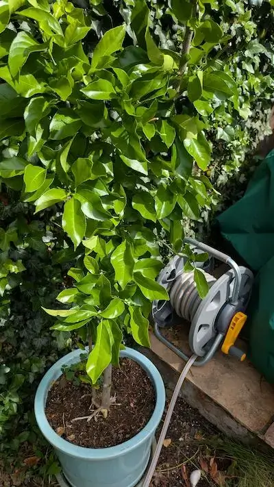
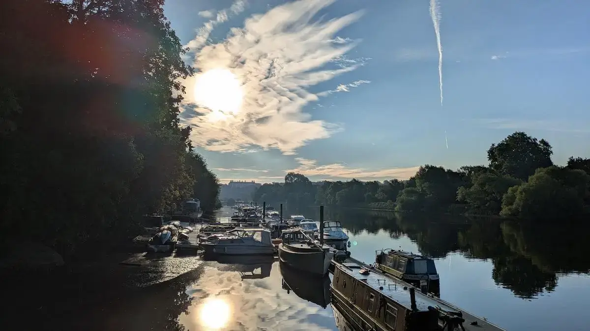
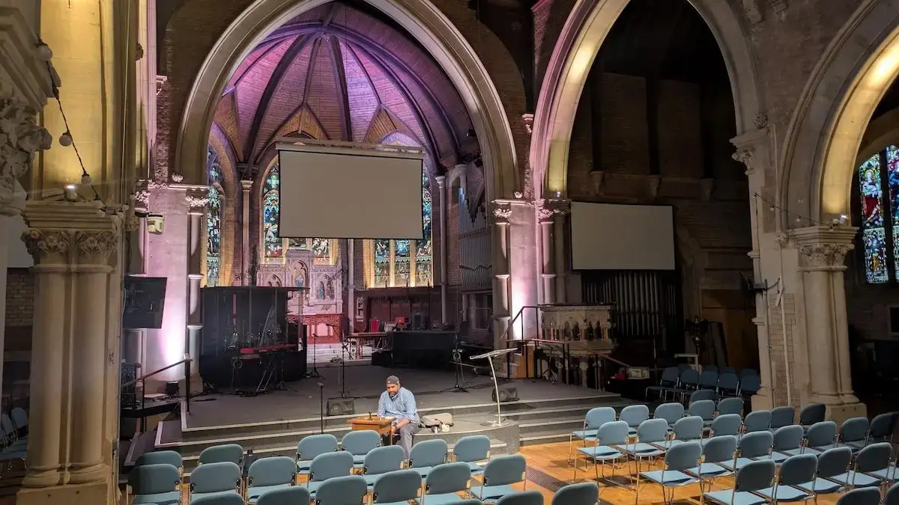
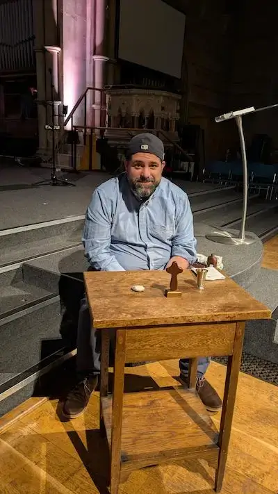

The [last time I wrote](../2026-05-28-a-cowardly-lion/index.md), treatment was beginning. It's been going for a couple of months now. 

I've done 5 rounds of chemotherapy, and 2 of targeted therapy. I know roughly what to expect, and my life is quite different. At least for now. So that's what I want to tell you about this time. My life now.

The best way I can think of describing it is this: I'm in lockdown. We all did lockdown back in 2020. We pandemicked together. I'm now pandemicking solo. Well that's probably the wrong word. I don't care. I'm going with it. For me it's round 2. I've had practice. I'm a pro.

I'm not going to the office. I'm not going to church. I'm not going to the cinema. I see tech meetups I'd like to be at happening in London. I'm not going to them. I don't really leave Twickenham, save for hospital trips.

My world has become physically smaller. But it is a good world. I feel blessed to be in Twickenham. I live in a nice house, with a garden. I have a family and a cat. I'm close to the river and I can walk and watch the sun rise. There is, as there always is, so much to be so very grateful for. And I am.

## Work

At the start of my adventures in March, I was learning how well, or rather how unwell I was. But it didn't become clear to me just how I was for a while. I started very gung-ho, saying "I'm going to carry on as normal, when I'm not so good I'll take some time out but I'll be fine." Not for the first time, or the last, I had no idea what I was talking about.

As the news got worse, I thrashed about, I was still going to the office and trying to work. But the problem was the people. We care, and we ask each other how we are. I work for a company that started in South Africa; Investec, and it employs many South Africans. They'll generally greet you with a cheery "howzit!" I do know, having worked with them for a number of years that this doesn't demand an exact response of how you are, but nevertheless I cannot help myself. 

So as I saw people in the office that knew and cared about me, I found it hard. I didn't want to tell them what was going on with me. Partly because I didn't have the full picture yet, and so I didn't feel equipped for the conversation. And partly I knew it wouldn't be a happy chat. I couldn't take it. So I withdrew.

I put my Teams status to "offline". I stopped going into the office. I started attending online meetings less. I'd leave my camera off so people couldn't see my face (which was a dead giveaway for how I was feeling inside). And I'd strategically join meetings late, to avoid any possibility of friendly chit chat at the start. The better to avoid questions.

No-one made me do this. No-one made me do anything. For a while a small number of people at work knew what was happening with me. They gave me space. They gave me support. Gosh they were human and good to me. I love them for that. I love Investec for that - care is part of the culture.

Anyway. I learned what my circumstances were. I learned that I was going to having some very serious treatment. And I realised that, being immuno suppressed, life had to dramatically change.

My working life now is really quite similar to lockdown. I open my laptop in the morning. I work. 

I'm not doing everything that I would have been doing before. It's not a good idea for me to be putting myself in the position where I might be a blocker if I couldn't work. It's not a good idea for me to be doing anything that might stress me out. 

But where I can make a contribution, I do. Work is good for us. I believe that in my very core. People need purpose. They thrive with it. They rot without it. We are at our best, when we think we're making the world a slightly better place.

So that's what I'm trying to do. When I can work, and that's often, I do. Medical appointments take me out of the game. The side effects of treatment can do similar. But when I feel okay, I will generally work. I want to.

Investec are helping me here. They're letting me make a difference, but they're not pressuring me to do anything. 

Apart from anything else, work nicely gets me out of my head. Left to my own devices, my mind can wander to unhappy places. Work nerdsnipes me into something more wholesome.

I'm joining meetings with my camera on now. I'll not join strategically late; I'll have the cheery chats and enjoy it. Oftentimes I'll find myself sharing my peculiar current lifestyle with those on the call. Possibly I'm over sharing. But that's quite Investec too. I feel part of something, and that makes me happy. These people love me and I love them.

Next Thursday a number of them are planning to do a sponsored run from the office in the City of London to the White Swan Pub on the riverside in Twickenham near me. They'll raise money for a cancer related charity named Maggies that I am grateful to. I'll get to see a number of them, in a socially distanced fashion. That's rather special. You don't get that everywhere.

## Home

My life at home has changed in a number of ways. I now sleep on a mattress on the floor, intentionally close to a toilet. For two nights out of every fourteen, I have a pump plugged into me that pushes chemotherapy into my bloodstream. For practical reasons, being close to the floor is helpful. The pump can sit on the ground and not be disturbed as I move in my sleep.

Alongside this, when you're on chemotherapy, you feel the need to drink water a lot. Your body is determined to flush out the toxins (remember chemotherapy is basically poison, but just worse for the cancer than you). The more liquid that goes into you, the more that comes out. I wake up multiple times in the night to go to the toilet.

So for now, having coughed up a ridiculous amount of money for a new bed at Christmas for the good of my back, I find myself instead ensconced on my son's old mattress on the floor. The irony is fantastic. But it's fine. This works. It won't be forever.

As well as making you drink more water, and urinate excessively, chemotherapy has other surprising side effects. It makes you burn calories. Really burn calories. You know how most of the year you're keeping an eye on how much you're eating? Then December comes and you go "oh forget it, I'm eating *everything*". Well on chemotherapy it seems like you have to eat that amount all the time or the weight just falls off you. I find myself eating 6 meals a day, with added double cream just to maintain my 85kg. It's weird. I'm in an eating competition I never expected to be. I told my brother and his response honoured the black humour of my family: "I need to get a piece of that action." 

I'm not going to church anymore. A compromised immune system and loving people that would try to hug me and breathe all over me don't mix. Singing seems hazardous; mobile germs. I'm not going to the gym either. Even worse on the breathing front, plus added sweat.

I am having one to one pilates and clinical PT sessions at my physio every other week. Move Physio in Twickenham. I started going there with my back issues last year, and they sorted me out. The pilates and PT sessions are somewhat adjusted given my current circumstances. The port in my chest restricts my movements a little (and my confidence; I'm scared of damaging it). However the sessions I'm having are keeping me on the straight and narrow and hopefully preventing any relapses on the back front. Quite apart from the physical side, the chats with Bal, Hannah, Justyna, Kia and everyone else do lift my mood tremendously as well. 

Despite all my best efforts, I still managed to get sick. Probably passed on from the enemy within; my beloved family. I did a day of hallucinations and toilet time. It's taken really seriously, getting ill when you're on chemotherapy. I've got a special card in my wallet to flash at the hospital folk. And if you get ill on chemotherapy, that's quite likely where you end up. Fortunately I didn't. The fact my family members got sick before and got better, and that I managed to not run a temperature was considered enough to keep me out of A&E. Phew.

I find myself watching Clarkson's farm on hard repeat. I do that because I enjoy it. I do it because I'm having a hard time. It gets me through. I can't really explain why. It's very beautiful to watch - the photography of English countryside is stunning. I find all the characters comforting. They're voices and personalities that I'm familiar with. Somehow it relaxes me. It turns off part of my head that does pointless thinking. I've watched each episode of Clarkson's Farm probably 10 times at least. I haven't finished the fifth series yet; we're savouring each episode and taking our time watching them together as a family. It's like when I was a boy and I'd re-read Asterix books again and again. It didn't matter much that I'd read Asterix in Corsica a million times, it brought me happiness. Peace. We all need that.

The children seem normal, by the way. Good. They were quite nervous when they first heard my diagnosis. Fair enough. But the fact that I still appear to be functioning fairly typically, if slightly differently, has eased their concerns for now it seems. The same level of general disobedience abounds. Chores are mostly not being done, and I am still being referred to as "bruh" for reasons that are unclear. Lisette is also referred to as "bruh". Go figure.

What else? I sit in the garden. I potter around my various plants and trees occasionally trimming the dead wood and picking up the partially eaten apples that the parakeets knock out of the tree as they come scrumping.

I look with great interest at my lemon tree. We grew it from the seed of a lemon from a lemon tree which was in the garden of a house in Mallorca we stayed in one Christmas. It's now a medium sized tree all of its own. Around January it lost all its leaves and started to seem very... Well dead to be frank. And I was very worried. But after being returned to the garden and experiencing the warm weather it has rejuvenated! 

So I look at the lemon tree and I think: "if you can come back from the brink, well so can I!"

## Pilgrimage 

I've always walked. I wake early, usually around 5. I walk around the river each day, stopping to take a photograph of the sunrise over the river at Hammertons Ferry terminal which I share on [Bluesky](https://bsky.app/profile/johnnyreilly.com) and with various family and friends. The walk resets me, brings me peace. It makes me happy. I stop and talk to people. I listen to the birds singing. I pray. I do stretches in the outdoor gym that draw questionable glances (not all stretches are delightful from a watchers point of view).

Walking is all the more important to me now. It has more purpose. If I can't go far, I must appreciate near all the more. I mentioned I'm not going to church. I found myself walking near church one Sunday morning, and a car rolled past me as I marched along and out came the cry "we love you John Reilly!" That made tear up. Quite lovely. Some people really show up. They really do.

Some don't. But I notice the ones that do. And I dig them. They're amazing. They're special. They make the world better. Can you believe an internet friend in California sent me homemade honey from his bees? That's generousity.

Walking has become my social life. I go for walks with friends from near and far. The record so far is held by the wonderful Graeme, who flew in from Johannesburg and came to Twickenham to walk with me. Rick flew in from Ireland and walked with me. Local friends walk with me regularly. My parents and my sisters family in Clapham are my regular companions. On one occasion Kirsty even brought a cheesecake that we ate together by the river. Simple stuff. Good times.

Everyone tells me I'm doing very well. And I think I am. Physically in particular. Mentally I'm up and down. Sometimes my body hurts. I have blisters on my feet and cuts; it's one of the side effects. Sometimes it's difficult to eat because your tongue aches and your throat burns. In those moments it feels more like you're not doing so well. That you're on the way out. Even if you know it's temporary. It's hard to get the head to hold onto that sometimes.

At times I feel "other". As I walk the streets I can feel a little like a ghost. Surrounded by the fit and healthy. Struggling to get back into their ranks. Wanting to be a part of the world, not apart from it.

Lisette is my support. She sees me at my lowest and she says "we're doing this". And she's right. The only way is forward. Together. We're doing this.

## Communion 

I said I'm not going to church. That's not entirely true.

About two thousand years ago, somewhere in Jerusalem, Jesus Christ had a meal with his disciples. It's called the Last Supper and He was crucified in the days following. At the meal Jesus took bread and wine and gave it to the disciples, saying "Take, eat; this is My body... this is My blood of the new covenant, which is shed for many for the remission of sins".

Since that time, Christians have gathered to have bread and wine and repeat this tradition in remembrance. It's called Communion. I've participated in it many times in my life. It brings me humility and comfort. That God would suffer for me. Surely I'm not worthy? But God thinks I am.

Thomas is one of the vicars at St Stephen's. He's been a great friend to me in this time. When I realised my new ways, I asked if I could take Communion sometime somehow. I didn't really know why I was asking, but it felt important.

So now, every other week, when I'm not having treatment, we have met for a one to one Communion. We've taken it outdoors, down by the riverside. We've taken it in the empty church building. We've taken it in the prayer chapel at church whilst the main body of the church was prepared for Refresh - a gathering of the babies and parents of Twickenham where the church becomes a giant play room. In fact on that occasion, parts of our Communion were soundtracked by Bluey, a children's TV show about a puppy. I'm pretty sure 1st century Jerusalem would have had its own unique background noises as well.

The only alcohol I've drunk since my diagnosis has been Communion wine. That's not forever. But it is for now. I go each time for Communion without expectation. Thomas and I will talk. At some point we'll turn to Communion. Unbidden, each time I find tears rolling down my cheeks and I am racked with sobs. I'm not thinking anything in particular. But it comes. I'm feeling. I'm probably processing something. I don't really understand.

In the end, the tears pass. I eat the bread. I drink the wine. I am grateful. This helps me.

## So, how am I?

At times I feel like an aeroplane in a second world war movie. Flying over enemy territory. Being shot at from below, but still flying. The only way is forward, we'll get there. "We're doing this."

A friend sent me a message; it's kind of the same thing but a lot more positive (and therefore better): 

> So as I have been praying for you this week I have an image of a big super tanker going through a stormy sea. Although the water is rough, I felt God saying the boat is designed to carry on. It will not sink. It will just keep going and you will come out the other side and the calm seas will return and you will be still charging round. I also had the image of lots and lots of small helper boats running alongside the tanker  - keeping you safe - helping to navigate the choppy waters. 

I like this.

I had cried every day since the diagnosis. The other day I didn't. Yes, I did cry today. But I have days when I don't. Maybe that's progress. Maybe.

I want more time. That's what I keep coming back to. I'm not ready to be commemorated by a park bench. I'm sat on a commemorative bench now, and it's wonderful. But I'm not ready for one. I want more time. And I want it to be real time; real life. Not marking time. 

Whilst I remember to notice all the positives, the sun rising, the kindness of friends and family, the love I am surrounded by.... despite all that there is a part of me that is scratching off days on my cell wall. I'm not proud of that guy, but he's in there. 

On the other hand, so is the man that walks around the river each morning, and takes a photograph of sunrise at the Hammertons ferry terminal. So is the man who strolls with friends and family. So is the man who is buying a croissant each morning and eating it with fresh coffee. And the guy who wanders around the garden feeling pleased with plants and trees. The chap that takes pleasure in coming up with new meals to cook and the one who goes for lunchtime meals with his wife in otherwise deserted restaurants.

I hope this gentleman can balance the other fellow out. I believe he can. I must nurture him.

For now my world has shrunk. Whilst it may be smaller, it is still wonderful. Maybe I'm looking at less, and seeing more. I certainly intend to.

We're doing this. We're doing this. I love my wife.
