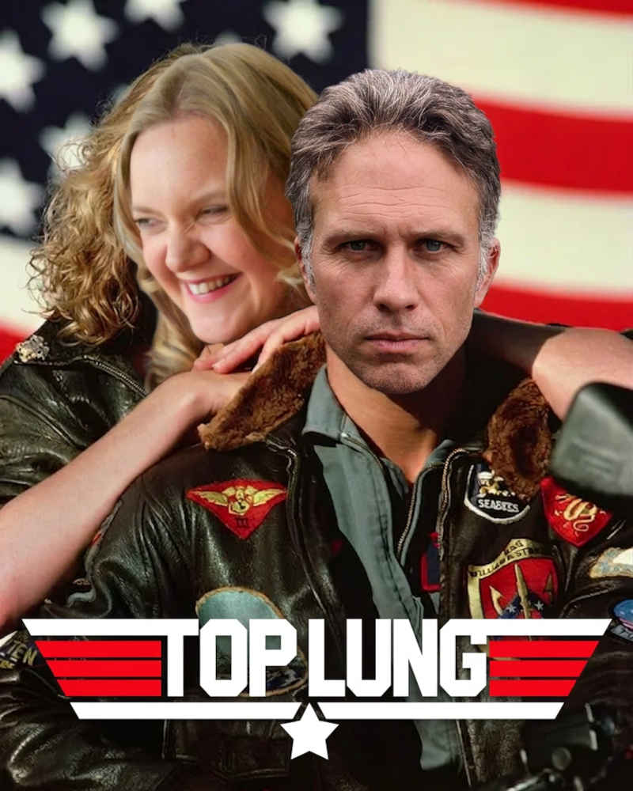
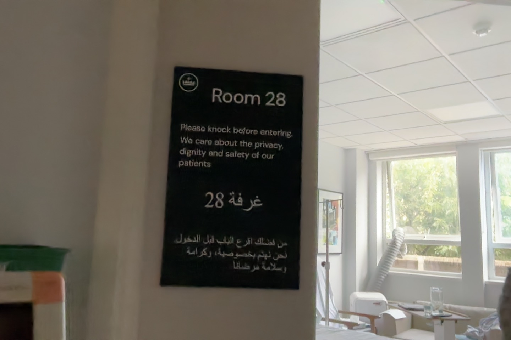
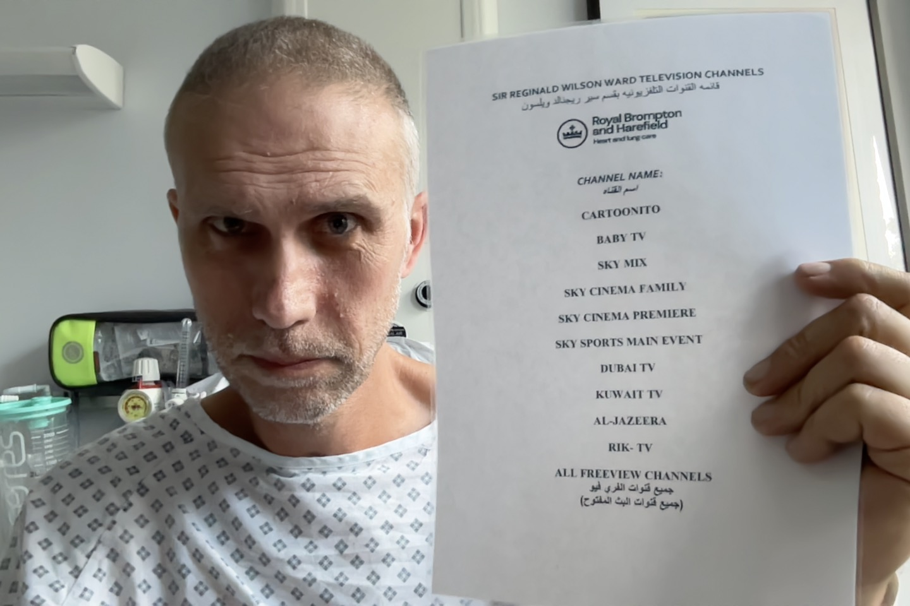

It was at 5:30am on Wednesday August 12th, that Lisette and I found ourselves Ubering from our home in Twickenham, to the Royal Brompton Hospital in Chelsea.  I'd had good news on my recent scans.  The tumour in my colon had shrunk, and the one in my lung wasn't showing up. This made the doctors feel it was safe to "finish the job".

{/*truncate*/}

What that exactly meant, was chopping off the part of my lung that had had a tumour. If that makes you swallow and draw breath, I can assure you it did that and then some for me. Way back in April, Lisette and I went to meet the surgeon in a swanky office near Harley Street; London's medical district for those with money. More on that later.

The surgeon was confident and affable.  I googled him (I google all people who might cut me open) and found that he was a ridiculously well regarded surgeon. He had a number of impressive strings to his bow, and this helped me relax a bit.  Additionally he was quite funny. Which I liked. But still.  Funny only gets you so far. He did want to do serious things to my insides. Knowing this, I listened to his pitch carefully.

"We'll use a robot John; keyhole surgery, probably five incisions - and using the robot means you'll recover much faster. You'll lose about 10% of your lung capacity."

My eyebrows had shot to the ceiling at this point; I very much didn't like the fact we'd hit double digits here. I pondered paraphrasing Rex Harrison and saying "but I've grown accustomed to the lung". But whilst I was mulling whether the surgeon was a fan of My Fair Lady, he was busy picking up on my brownian motion.

"Smokers live with less John.  The surgery won't be fun, but in a month or two, you'll honestly barely know the difference."

Not for the first time in my recovery journey, I found myself deciding to defer to the experts.  Well, let me be more candid: as we walked back to Waterloo station, I raged against the world about how sad / angry / frustrated that I was with how my life was going, and Lisette reminded me that I was getting treatment, some of the best going, and I should grab it with open arms.  As ever, she was right.

So, that's how Lisette and I found ourselves heading into hospital that morning. I was mulling what I should call this post.  *"The one where they cut out some of my breathing bits"* didn't appeal. Then I was reminded of the classic song from Top Gun; Berlin's *["Take my breath away"](https://www.youtube.com/watch?v=Bx51eegLTY8)*.  It seemed to sum up my situation up gloriously. I'm not using AI to write these words.  But the image below, well I can only take credit for the idea.

## Buylingual

I was to be admitted to the Sir Reginald Wilson ward of the Royal Brompton; a hospital known for heart and lung care. The ward I was being admitted to was strictly for private patients.  Through my work, I had access to private healthcare, which I had started using fairly early on in this grim process.

Before last year, I'd had no experience of private healthcare at all; having been happily cared for by the NHS since my birth.  For those reading this who don't know what the "NHS" is; it's the [National Health Service](https://en.wikipedia.org/wiki/National_Health_Service) and it is the organisation that serves the health of UK citizens most admirably, and has done for many years. It is much loved.  Saying something bad about the NHS is considered akin to blasphemy in the UK. Probably worse.

In the UK at least, private healthcare and the NHS can be compared to the class of ticket you have for a flight. Whether it's private healthcare or the NHS, the treatment is likely to be identical. The people that treat you may be the same, the medication / procedures you experience are likely to also be the same. Just as on a plane, regardless of whether you're travelling in first class or economy, you're still flying to Palma De Mallorca.  (Or wherever, I mention that as an airport that I have flown to many times to visit family.) 

However, there are two differences between private healthcare and the NHS that are worth drawing attention to.

### 1. Speedy boarding

You might get to board earlier, or get treated earlier, with a first class ticket / private healthcare. Whilst that's arguably a nicety for the purposes of travel, it's really significant for cancer diagnosis. As the faster you get treated, the less the treatment is likely to suck.  (Note to all: cancer treatment is reliably an unjoyful experience at any level. I encourage you to reduce the risk of sadness to a minimum by all means. If you have the opportunity for a scan; have it.) 

### 2. Leg-room and refreshments

If you're a 190 centimetre / 6 foot 3 inches tall man, and I am, you'll be aware of the horror show that is leg-room on an economy flight.  Tortuous, but something that can be borne for two hours to make a holiday cheaper. First class, and even premium economy are much more bearable on the leg-room front. What's more, someone will bring you food and drink as well. Private healthcare is basically that.  You're unlikely to find yourself on a ward whilst you're in hospital; you'll probably have a private room.  As well, the food and drink will be better.

"I hope he's going somewhere with this", I can hear you muttering.   I am, I promise. 

I'd like you to ask yourself this question: have you ever been to Wales?

When you go to Wales, you'll quickly notice that roadsigns are typically marked in both English and in Welsh. Because there are people driving that speak English, and people driving that speak Welsh. A sight like this is common:

 

A similar approach was in place throughout the Sir Reginald Wilson ward.  All signs were displayed in English and ... Arabic. I know, I didn't see that coming either!

What were we to conclude from this?  At first we found ourselves wondering "why don't the Welsh like private healthcare?"  Thinking further, we pondered "perhaps Arabic speakers are more likely to purchase private healthcare and are also prone to health issues which affect their hearts and / or lungs?"  

The answer turned out to be a little less from column A, and a little more from column B.

My room overlooked a small forest of trees and [St Luke's Church](https://en.wikipedia.org/wiki/St_Luke%27s_Church,_Chelsea); where Charles Dickens married Catherine Hogarth back in 1836. One day, as we sat there, I put the question to one of the nurses who was in my room taking my blood pressure: 

- "How come the signs are written in both English and Arabic?"
- "You noticed! A significant proportion of our patients fly here from the Middle East on private planes."

This was not the answer I'd expected. But it stacked up.  To pass the time in the hospital after the operation, I repeatedly wheeled the rack of medical equipment that was connected to me around the corridor. I am, by nature, a walker; even when the terrain is poor and I am reduced to Dalek-like status on the stairs front. I became an expert on who was in each room as I would see a little of them each time I did a lap.

I encountered people that I'd guess were from the UK. Based on accents overheard, I encountered one man who was probably from the US. Alongside that I encountered many more examples of folk that could well be from the Middle East.  The TVs were playing Dubai TV / Kuwait TV and Rik TV.  Large boxes of dates could frequently be sighted, which made me quite peckish.  Dates are fabulous. The clothes worn were not London typical. I'm making assumptions here I know; I could be wrong. 

The visitor demographics lined up with what the nurse had said as well.  Whilst the English speakers would tend to have one visitor, or maybe two, at a time, the Arabic speakers tended to have around six.  If you're going to travel by private plane, why not bring everyone? At least in one case, it seemed that the trip to London might well have been medical treatment for one family member, but had been co-opted as a shopping trip by another.

## Going under

By 6am on Wednesday August 12th I'd been admitted to hospital.  By 7am I'd been issued with a hospital gown, dark green pressure socks to stop me developing deep vein thromosis, and slipper socks which I was to wear over the top as I navigated the hospital. I was a modern day [Wee Willie Winkie](https://en.wikipedia.org/wiki/Wee_Willie_Winkie).

Instructed to get into a hospital bed and lie down, it occurred to me that I hadn't actually seen the surgeon since our meeting four months ago and I wasn't entirely clear what was going to happen next. Off the bed went, trundling towards the room where I was to be put to sleep.  Almost by coincidence, or so it seemed, we bumped into the surgeon on the way who shook my hand as I lay in bed. I took the opportunity to ask a few questions about the procedure. He looked a little surprised as to my interest, but happily explained his plans.

I'd say that this was a typical example of what treatment has looked like for me along the way. I have a sense that I'm meeting smart, talented people, who are very good at their jobs.  Sherlock Holmes type figures of medicine. However, if I was to characterise their life perspective, it's them versus whatever aspect of sickness / illness / disease they've set their face against. They are farmers tending to their meat vegetables.  Or better, perhaps they are vets, treating some bullocks that seem a bit peaky. The surprise that registers on their faces when the livestock turns around and asks a question about the treatment, is comparable to when a "Son of Adam" or "Daughter of Eve" first encounter the talking animals in Narnia.

This is not a criticism - I want smart people to be tending to me and using their God given gifts to bring me back to health. I don't much mind what shape they are. The surrealness of it all still entertains me though.

By 8:35am I found myself in a room with three anaesthetists.  All women.  All at least six feet tall.  I have no idea if this a general trend in the anaesthesia community or not. They cracked jokes about them biasing the recruitment process. Because they're good at their jobs, by 8:40am I wasn't awake anymore.

## Recuperation 1

I came to, sometime in the afternoon. Lots of things hurt.  I could still breathe, and that was a relief.  I did some test breaths, and whilst it felt sore and a bit odd, the lungs still seemed to be lunging. (That is the verb?)

It is at this point that I must take a slightly different tack.  I want to be honest with you. Maybe I've made you grin with some of the things I've written today.  That would please me. But I want what I'm saying to be underpinned by sincerity about the circumstances in which I find myself. I can't pretend the next week in hospital was easy.

I was attached to many things.  Tubes were pumping chemicals into me.  Other tubes were taking things out of me. You should know that I am someone who has no piercings, never wears any form of jewellery and doesn't even wear their wedding ring as I am almost phobic of the feeling of being permanently physically attached to anything. This was a form of hell for me. Let me not underplay it, I *hated* it. 

But there was no other option.  I had to grin and bear it.  Or not grin but still bear it.  I managed the latter, gracelessly.

It was hard.

Physically, my body was battered.  Breathing hurt.  Coughing hurt. I was connected to various pieces of equipment and they each contributed their own portion of pain to me.

Mentally, I was a mess. General anaesthetic and a bucketload of prescribed drugs will lend themselves to that. But I was also really upset being away from home, away from my family.  Being permanently connected to equipment which meant that all movement was slow, painful and inconvenient lowered my mood further.

I had visitors.  My wife came.  My sister came.  My parents came. I was rubbish company. At one point my sister was showing me her pictures of her family's trip to Cornwall to watch the eclipse.  People and pets on a beach on a sunny day. Family together, enjoying this remarkable universe we've been put into.  That felt so far away from me as I sat in the hospital room in London, connected to equipment.  I found myself crying.  Tears rolling down my cheeks. I moaned and wailed, simply feeling sorry for myself.  Then, the physical pain of moaning and wailing hit me; I felt pain from my newly inflicted medical injuries.  Crying hurt me physically. So then I cried some more because I was in pain.

I was low. Sad. My life had become the lived experience of things I cherished being taken away from me. That's what it felt like. "Is this what I get now? Is this what I can look forward to?"  It was hard to imagine a life where I was a dad and a husband again, not just a distant patient. Useless to everyone he cares for.

As I write this now, I acknowledge that this is not how other people saw it.  My perspective was poor. I was feeling sorry for myself, and I was addled by pain, drugs and the physical and mental trauma of a surgery.  It is hard to remember to be kind to yourself, even if you intend to be.  I don't think I'm very good at it. Not in the moment.

## Recuperation 2

Why am I telling you about my lowest times? I think, because they pass. And that is worth noting. Let me illustrate this in a roundabout way.

On the Sunday morning, something went wrong with the catheter that had been connected to me for five days. The catherter was a needle that hooked into my back and delivered pain relieving drugs.  It going wrong lead to two hours of agony.  Really extreme pain.  I had ibuprofen, paracetemol, something I don't know the name of and liquid morphine all pumped into me within twenty minutes.  They made no difference.  

As an aside, the liquid morphine was delivered in the form of the purple syringe which was pumped into my mouth as though it was Calpol being delivered to a teething toddler.  As a parent, I know what Calpol tastes like, and can confirm that liquid morphine and Calpol taste identical.  From here I suggest you draw your own conclusions. 

The nurses left my room as I continued to shriek every thirty seconds in pain. In a moment which seems comical in retrospect, but really didn't at the time, the kitchen staff came into my room in response to my wails. They pushed the button to summon the nurses and said to me "you need help".  I then had to explain to the nursing staff that it wasn't me who had pressed the button to summon them back.

At that point, life was unbearable.  Unbearable.  All I did was scream, then pray for relief and attempt to replicate "birth breathing" which Lisette had taught me. "I've had two babies you know!" In fairness, the breathing was more effective than the drugs; which weren't even touching the sides. 

Then, the nurse took out the catheter. Over the course of the morning the pain ebbed away, until it was gone. I could see once more that the sky was blue.  That I would be going home to my family in a matter of days. That I had had potentially life saving treatment, and whilst it was hard, I would recover. I could see a future.  It had only been hours since the sky was black and I was serving a life sentence in prison.

It's okay to find things difficult.  Bad days are unavoidable.  We're not always up; sometimes we're down. God still loves us. Life is still good. We are blessed in many ways, even if we're not managing to notice them. 

The feelings we have when we are at our lowest can change.  They can lift.  They are quite likely to; if we give it a little time.  I know this right now.  I technically knew it when I was finding life tougher, I just didn't have the energy to believe it. That doesn't make it less true.  I write this, in the hope that perhaps I will read it when I need to, to remind myself.  And maybe I'll be convinved of it. Just a little bit.  Maybe.

As I look back on this experience, I'm aware of my weakness. I am weak. I'm grateful that I am surrounded by people that love me, think of me, pray for me. We can't be strong at all moments. We carry each other.

This surgery is done.  I have come home to a family that loves me. I will recover from this experience. In time, I will be ready for the next stage of my treatment.  

Some of my breath has been taken away. I may have less breath, but I have enough.  

---

<RecoveryDiaries />