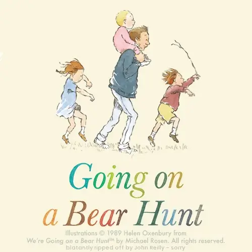

On Wednesday 9th September Lisette and I visited three hospitals. We caught a tube, a bus, four trains and an Uber after some poor soul was hit by a train, and we were detrained mid journey.

I had an X-ray at one hospital, then scurried to the next to see the surgeon who had [operated on me the previous month](../2026-08-25-take-my-breath-away/index.md). When he appeared, he greeted us with a "the news is excellent!" I like medical folk with good news.  He looked over the X-rays briefly, but his purpose was mostly to debrief me. "The tumour was 90% non-viable when we got it out, so the treatment had been working. We checked the surrounding lymph nodes and all clear I'm happy to say."

{/*truncate*/}

The surgeon wanted to inspect his handiwork, and so I found myself topless and reaching for the sky as he inspected the scars and scabs that now adorned the right side of my chest and back. 

Separately, my PT instructor had also taken a look at me, and remarked "it looks like you were in a drive by shooting". I've looked in a mirror and there is something in that comparison. That said, if it wasn't for keyhole surgery, it'd look like they'd been trying to fit my chest with a zip. Silver linings.

Not for the first time in this process, I was put in mind of the phrase "we've got the builders in". When someone comes to renovate your house, they're going to need tools and equipment. It doesn't make sense to lug that in and out of the homestead each day, and so whilst the renovation is going on, you'll be sharing your living space with all kinds of drills, saws and who knows what else.

I am the building. I am being renovated. I am measured, I am weighed. I have a port living in my chest until the work is finished and I am signed off. I am looked at, I am poked with pointy things. I'm discussed in meetings and chewed over like I was a  property with rising damp.

It's quite disconcerting, but I'm getting used to it. As I waved my hands at the ceiling for the surgeon I reminded myself that, once again, I should get over it. For now, my body is not mine. I've handed over jurisdiction for the physical aspects of John Reilly to my medical team. For now. Not forever.

The surgeon was happy with what he saw and urged me to reclaim what remained of my dignity, and put my T-shirt back on.

"You're signed off John. Your lung has gone as well as I might hope. I'll discharge you and you can get on with tackling the tumour in your colon." 

He reached forward and shook my hand. "I hope to never see you again, unless it's on Richmond Hill with ice cream."

## Hostage and Captor

At the other hospital we saw the doctor in charge of my treatment. Happy with progress, she signed me up for six more rounds of chemotherapy and targeted therapy. I was happy, and also not.

[Stockholm syndrome](https://en.wikipedia.org/wiki/Stockholm_syndrome) is, apparently, not actually a thing, but most of us will have heard of it. From Wikipedia:

> Stockholm syndrome is a disputed disorder in pop psychology characterized by the tendency of hostages to develop a psychological bond with their captors. It is named after an attempted bank robbery in 1973, in Stockholm.

I thought of Stockholm Syndrome often when I thought of restarting the chemotherapy. I had no enthusiasm for the process of chemotherapy, but I knew that it was the thing I needed to do. Despite my reservations, I was almost uncomfortable that I wasn't currently having treatment. I wasn't doing anything to make the tumours life unpleasant. That felt lax. I wanted to be metaphorically banging on its door and shouting "hey you, don't settle in, you are *not welcome* and I want you gone".

There's a book which we used to read to our boys called ["we're going on a bear hunt"](https://en.wikipedia.org/wiki/We%27re_Going_on_a_Bear_Hunt).  It features the phrase "we can't go under it, we can't go over it, we have to go through it". It's that same phrase that my oldest boy Ben quoted back to me after I discovered that he'd shoulder charged our back gate when it got stuck. (Don't ask.) Home vandalism aside, the sentiment holds true for my own situation. I can't get away from the fact that I need to have chemotherapy. I have to go through it. So I shall. My own bear hunt.

The most scared I have ever been in my life, is when my youngest son James went missing. He was very young then; maybe three or four. We were in the middle of London. Lisette wasn't there. One moment he was with me, then he'd vanished. The fear I felt in the next three minutes as I looked for him will stay with me forever. He was fine. I found him in a playground that he'd discovered around the corner. He was laughing on a roundabout; delighted by his discovery. He has no idea what that three minutes did to me. Gosh I love him. I love them both. That three minutes scared me. Terrified me.  

The kind of scared I felt then was a fear of something I did not think I could take. The first time I had chemotherapy I was very, very scared. I was concerned then that I would not be able to bear it. This time I think I'm not scared. It feels strange to write that, but I believe it is true. I dread what will happen. I will hate it. But I don't fear it. 

I know it will mess with my head somewhat; it did last time. Right now I feel strong. I feel like me. I know that wasn't so much the case when I was on chemotherapy last. In a little while I may again not feel quite like me. But it's not forever. Despite everything, I am impatient to begin. The sooner I start, the sooner I finish. I'm going on a bear hunt.

## Turn all things for good

I have two things in common with the musician Pete Doherty. Firstly, we both have too much experience with hypodermic needles. Albeit for very different reasons. Secondly, we share a love for the English comedian Tony Hancock. 

There's a good chance you don't know who Tony Hancock was, but for a time in the 1950s, Hancock was the most popular comedian in the UK. At his peak, a third of the population watched and listened to his shows. The pubs and streets would empty when they were broadcast.

Tragically, Tony Hancock died by suicide. He was alone and far away from home in Australia. But his comedy has lived on. I grew up listening to it, as did Pete Doherty.  Denis Norden put it rather beautifully when reflecting on Hancock's life. He said:

> For a comedian to leave behind that kind of echo of remembered laughter – it is hard to think of his life as a complete tragedy.

There was tragedy in Hancock's life. But something very good came out of his life too. 

There's a story in the Bible of a man named Joseph. His tale was made famous by Andrew Lloyd Webber's musical "Joseph and the Amazing Technicolour Dreamcoat". That guy. Towards the end of his life he says to his brothers (who were rotters by the way):

> [~~Any dream will do.~~](https://youtu.be/VfNMhu9wdl0?si=vuA_4uM8qS3em_E1) You intended to harm me, but God intended it for good (Genesis 50:20)

I feel somewhat that way about my current circumstances. As though the cancer wants to harm me. I do not believe God intended me to suffer. I'll admit that on my worst days, and the mind can go to terrible places when you're down, I have wondered. But in the end, I don't buy that. I don't believe God has it in for me. This is an imperfect world, and cancer is a thing that happens. That sucks, but it is so. Rather, I am convinced that God would want to turn this grotty situation to the good.

Given this set of circumstances is my lot right now, I want to be useful. I think I can be.

I recently discovered that a friend was due to start chemotherapy. It turned out they were due to be on the same "flavour" as I have been. I was able to share my experience with them, and hopefully remove some fear. I know when I was in their position that I was pretty scared. Having done chemotherapy once, and given that I'm presently limbering up for my second go, I could say "It's rubbish, but doable; you'll be okay." It's not a walk in the park, but it is not something that cannot be borne.  It can be. I'm proof.

I don't know where things end for them, or for me, but there's reasons for optimism. And there's reasons not to be too anxious whilst we travel the road to find out. I'm very much hoping that this is something we go through, and come out the other side. I cannot guarantee that, I know. But that's my North Star. 

So, chemotherapy time once more. It's time to get back on that horse. Here we go again. I will not enjoy this, but I will do this. And the kindness of those around me will help make it easier. 

I was wrong when I said "I'm going on a bear hunt". I am not alone. We're going on a bear hunt. We, not I. We. We're going on a bear hunt.

---

<RecoveryDiaries />